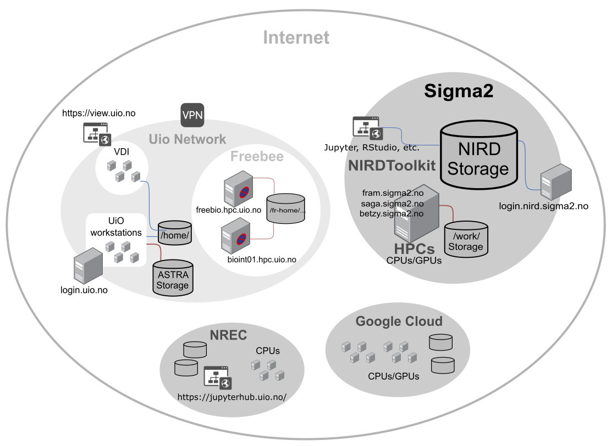

Overview of the computing resources at the University of Oslo
===============================================================

Remote access
--------------

   How can you work from home?  For that matter, how can you work on more than your desktop/laptop while at work?  There are many options which trade off between graphical interfaces and more power.  Read more for details.
   
   With increased mobility of working conditions and recent global events that recommend tele-working, you might be asking yourself: "how do I stop using my workstation at the dept, and get analysis/figures/papers done from home?". 

   The data analysis workflows from remote might not be familiar to everyone. This course aims at providing you with an overview of the computing resources available to researchers working at the `University of Oslo <http://uio.no>`_ according to your needs and requests.

.. prereq::

   Make sure you have read the `Introduction to Linux and Aalto Computing <https://scicomp.aalto.fi/training/scip/intro-linux-aalto-computing/>`_.
   
   To get ready, follow our `preparation instructions <https://scicomp.aalto.fi/training/scip/intro-linux-aalto-computing/#preparation>`_.
   
   
What's your style?
------------------

To get started, you can use Jupyter (4) and VDI (3) which are good for developing and prototyping. 
Then to scale up, you can use the options: 7, 9, 11.  If you need the most power or flexibility, use `the services from the Norwegian e-infrastructure for Research & Education (Sigma2) <https://www.sigma2.no/>`_ for your data storage and computation (`Apply for Sigma2 resources <https://www.sigma2.no/apply-e-infrastructure-resources>`_ and `account required <https://www.metacenter.no/user/application/form/notur/>`_ for 4-8).
 
If you need simple applications with a graphical interface, try 3 (VDI).

If you use your own laptop/desktop (1, 2), then it's good for getting started but you have to copy your data and code back and forth once you need to scale up.

Summary list for remote data analysis workflows
------------------------------------------------

   * Good for data security: 3, 5, 6, 7, 10, 11
   * Good for prototyping, working on the go, doing tests, interactive work: 1, 2, 3, 4, 5, 6, 8
   * Shares UiO data (e.g. home folders): 2, 3, 6,
   * Easy to scale up, shares software, data, etc: 5, 9, 11
   * Largest resources available 11 (medium: 9, 10)
   * GPUs resources available 7, 9 (and to some extent 11)

.. note::

   If you are dealing with sensitive data, you would need to use dedicated services for `sensitive data <https://www.uio.no/english/services/it/research/sensitive-data/index.html>`_.

Except if stated otherwise you will not be able to access your UiO data (UiO home & `astra <https://www.uio.no/english/services/it/research/storage/researchers.html>`_). 
     
     
1. Own laptop/desktop computer
     * Can work from anywhere. Does not require internet connection.  You are in control.
     * Not good for personal or confidential data. Computing resources might not be enough. Accessing large data remotely stored at UiO might be problematic - you will end up having to copy a lot.  You have to manage software yourself.
     * Excellent for prototyping, working on the go, doing tests, interactive work (e.g. making figures). Don’t use it with large data or confidential / personal data.
     
2. UiO laptop
     * Same as above, plus same tools available as UiO employer. The list of tools pre-installed on your laptop usually may depends on your institute or department or local group policy (in particular for some paid software).
     * Usually not allowed to install yourself software/packages
     * Access to your UiO home area and ASTRA storage

3. Remote virtual machine (https://view.uio.no/)
     * Computing happens on remote. Data access happens on remote, so it is more secure.
     * Computing resources are limited.
     * Many packages available (often many more than what you can have on your laptop)
     * Excellent for prototyping, working on the go, doing tests, interactive work (e.g. making figures). More secure access to data.
     * Can access your home area

4. UiO Jupyterhub (https://jupyterhub.uio.no/)
     * Cloud based - resume work from anywhere.  Includes command line via Jupyter Terminal.  Local data can be copied (a procedure is available if this service is used for teaching) but no access to your UiO data.
     * Jupyter can `become a mess if you aren't careful <https://scicomp.aalto.fi/scicomp/jupyter-pitfalls.html>`__.  You need to plan to scale up with #8 or #9 eventually, once your needs increase.
     * Excellent for prototyping, working on the go, doing tests, interactive work (e.g. making figures).  
     * Mostly used for teaching
     
5. Interactive graphical session on `UiO servers <https://www.uio.no/english/services/it/research/hpc/freebee/>`_ (ssh -X freebio.hpc.uio.no or on request to bioint01.hpc.uio.no)
     * Graphical programs.
     * Lost once your internet connection dies, needs fast internet connection.
     * A general workhorse once you get comfortable with shell - many people work here.

6. Interactive command line session on UiO servers (ssh login.uio.no)
     * Works from anywhere. Few resources and for a short time.
     * Limited time limits, must be used manually.
     * Mostly used to "enter" University network and gain access to other UiO services.
     * Can access your home area and ASTRA storage

7. `GPU / Machine learning resources <https://www.uio.no/tjenester/it/forskning/kompetansehuber/uio-ai-hub-node-project/it-resources/ml-nodes/index.html>`_
     * Works from anywhere. Dedicated to machine learning and deep learning tasks.
     * No time limits
     * Need to request access (justify your needs)
     * Only if your applications can use GPUs

8. `Norwegian Research and Education Cloud <https://www.nrec.no/>`_
     * Fast, standardized servers and storage for the Norwegian higher education sector.
     * Get access to a self-service, modern and secure cloud infrastructure, available when you need it.
     * HPC-cloud can be requested too
     * Small projects available to everyone by default and for larger projects by using `this web form <https://request.nrec.no/>`_.
     * Basically you are on your own (root user) so this service is recommended to more advanced users

9. `Google Cloud Platform <https://www.uio.no/english/services/it/computer/gcp/index.html>`_
     * Very similar than NREC (for advanced users)
     * Gives you access to more computing power (including HPC-cloud), analytics, machine learning products, developer tools and much more.
     * Very versatile (more options than for NREC for processors, memories, disks including SSDs)
     * Price depends on the performance, data location, access, etc.

10. `NIRD Service Platform <https://www.sigma2.no/nird-service-platform>`_
     * On-demand data analytics services, such as AI/ML algorithm, JupyterHub and Jupyter Notebook
     * Cannot access UiO storage but can access NIRD project areas
     * Require to submit an `application for data storage <https://www.sigma2.no/data-storage>`_ (evaluated and granted by a resource allocation committee twice a year)
     * Minimum storage 10TB
     * NIRD project managers need to request access to this service
     * Require "advanced" knowledge to customize services for your needs.

11. `Non-interactive batch HPC computing on Sigma2 <https://www.sigma2.no/high-performance-computing>`_ (ssh + sbatch)
     * Largest resources, bulk computing
     * Need to script your computation
     * When you have the largest computational needs
     * `Overview of Sigma2 HPCs and Online documentation <https://documentation.sigma2.no/hpc_machines/hardware_overview.html>`_
     * Need to submit an `application for computing time <https://www.sigma2.no/high-performance-computing>`_ (evaluated and granted under conditions by a resource allocation committee; twice a year)
     

.. toctree::
   :maxdepth: 1
   :caption: The lesson

.. toctree::
   :maxdepth: 1
   :caption: Reference

   quick-reference
   guide

.. _learner-personas:

Who is the course for?
----------------------

This course is for any researchers working at the `University of Oslo <http://uio.no>`_.

About the course
----------------

This short course will give you an overview of the computing and storage resources available to researchers working at the Unviersity of Oslo. 

See also
--------

- `Intro to Linux and Aalto University Computing <https://scicomp.aalto.fi/training/scip/intro-linux-aalto-computing/#jan-2020-intro-to-linux-and-aalto-computing>`_.

- `IT Services for Research <https://www.uio.no/english/services/it/research/>`_.

Credits
-------

A big thank you to the University of Aalto!

